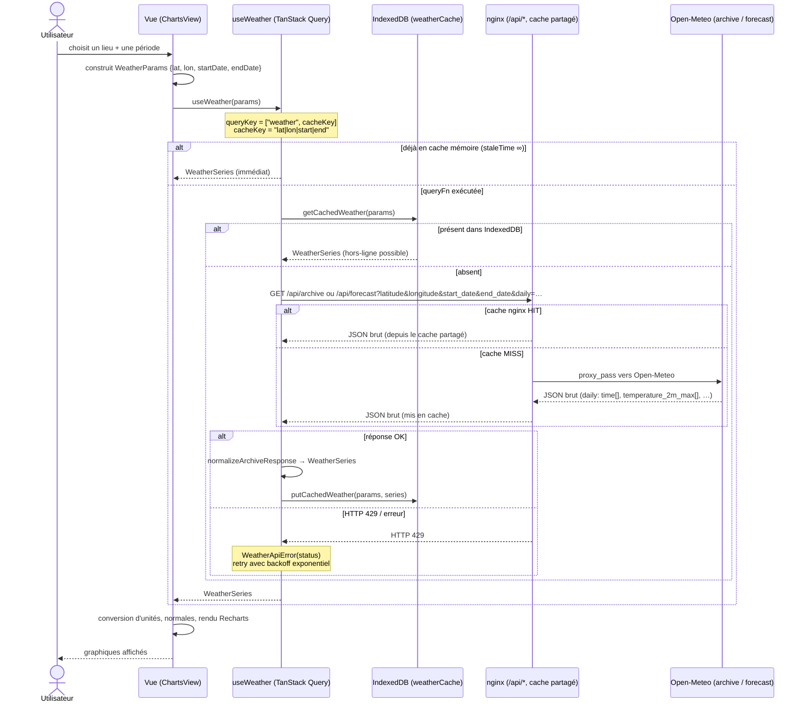

# Weather Archive

PWA de consultation des archives météo officielles (France et au-delà), à partir
des données [Open-Meteo](https://open-meteo.com/). En ligne :
**https://archivesmeteo.pleymor.com**

Trois modes :

- **Jour** — la météo détaillée d'un lieu à une date précise (heure par heure +
  résumé du jour), avec un volet dépliable **Records & histoire du lieu** : météo de
  ce jour calendaire à travers les années (avec tendance), records absolus et synthèse
  climatique depuis 1940.
- **Période** — graphiques de température (min/max/moy), précipitations et vent d'un
  lieu sur une période ; superposition des **normales 1991-2020** et **écarts à la
  normale** ; **comparaison** avec une autre ville.
- **Carte** — choroplèthe de France colorée par la température (bascule **Min/Max**),
  zoom région → départements, clic pour ouvrir un lieu.

Autres fonctionnalités : **URLs partageables** (l'état est dans l'URL), **lieux
favoris & récents**, bascule d'**unités** (°C/°F, km/h / m/s / mph), **export CSV**,
installable en **PWA** avec cache hors-ligne.

## Stack

React 19 · Vite 8 · TypeScript · TanStack Query · Recharts · IndexedDB (`idb`) ·
vite-plugin-pwa (Workbox). SPA front-end, servie derrière un mince reverse-proxy
nginx qui met en cache les réponses Open-Meteo (pas de backend applicatif).

## Données

- Données météo : Open-Meteo, atteint via un proxy **same-origin** (`/api/*`) :
  - `/api/archive` → `archive-api.open-meteo.com/v1/archive` (historique depuis 1940) ;
  - `/api/forecast` → `api.open-meteo.com/v1/forecast` pour les ~90 derniers jours
    (inclut les valeurs provisoires du jour même).

  Le choix de l'endpoint est automatique selon la date de début demandée
  (`weatherApiBase`).
- Geocoding : `https://geocoding-api.open-meteo.com/v1/search` (appelé directement).
- Reverse-geocoding (géolocalisation) : BigDataCloud (gratuit, sans clé).
- Fonds de carte : GeoJSON régions/départements simplifiés
  ([gregoiredavid/france-geojson](https://github.com/gregoiredavid/france-geojson)),
  embarqués dans `public/geo/` (aucune tuile externe).

Les données historiques sont immuables et mises en cache de façon permanente dans
IndexedDB ; l'app est installable et consultable hors-ligne pour les requêtes déjà
chargées. Côté serveur, nginx met en cache les réponses Open-Meteo et les partage
entre tous les visiteurs (une seule requête amont par couple lieu/période).

## Fonctionnement technique

### Architecture

SPA React servie en statique ; les seules dépendances serveur sont nginx (fichiers
statiques + proxy de cache vers Open-Meteo) et BigDataCloud/Geocoding appelés
directement. L'état applicatif (mode, lieu, période ou date, lieu de
comparaison) vit dans un contexte React et est sérialisé dans l'URL (`lib/urlState`)
— d'où les liens partageables. Les vues (`DayView`, `ChartsView`, `MapView`) lisent
cet état et déclenchent les requêtes via des hooks TanStack Query : `useWeather`
(série sur une période), `useHourly` (heure par heure), `useNormals` (normales
1991-2020), `useFullHistory` / `useDecade` (historique d'un lieu pour les records) et
`useChoropleth` (carte).

### Récupération des données météo

Les données historiques étant immuables, la récupération est **cache-first sur trois
niveaux** :

1. **Cache mémoire** de TanStack Query (`staleTime: Infinity`) — réponse instantanée
   si la requête a déjà été faite dans la session.
2. **Cache persistant IndexedDB** (`cache/weatherCache`), clé `lat|lon|start|end` —
   survit aux rechargements et permet la consultation **hors-ligne**.
3. **Cache partagé nginx** côté serveur — une seule requête amont vers Open-Meteo par
   couple lieu/période, mutualisée entre tous les visiteurs.

Le réseau (`fetchWeather`) n'est sollicité que si les caches client sont vides ; il
vise le proxy same-origin `/api/archive` ou `/api/forecast` (`weatherApiBase` choisit
selon la date), où nginx sert depuis son cache ou interroge Open-Meteo. La réponse JSON
est normalisée (`normalizeArchiveResponse`) en `WeatherSeries` puis stockée. Les erreurs
**429** (rate-limit Open-Meteo) sont rejouées avec un backoff exponentiel
(2 s → 4 s → 8 s) et la carte limite la concurrence à 4 requêtes simultanées. Le même
chemin sert le mode « Jour » (période d'un seul jour).

En développement, c'est Vite qui reproduit le proxy `/api/*` (voir `vite.config.ts`)
pour que l'app appelle les mêmes URLs same-origin qu'en production.



Le choix d'un lieu est lui-même une étape préalable : `LocationSearch` interroge le
**Geocoding API** (autocomplétion) ou, via la géolocalisation du navigateur, le
**reverse-geocoding** BigDataCloud, pour obtenir les coordonnées `lat/lon` qui
alimentent ensuite `WeatherParams`.

## Développement

```bash
npm install
npm run dev        # serveur de dev
npm test           # suite Vitest
npm run build      # build de production (tsc --noEmit && vite build)
npm run preview    # sert le build de production
```

## Déploiement

**Déploiement continu** : chaque push sur `main` déclenche le workflow GitHub Actions
[`.github/workflows/deploy.yml`](.github/workflows/deploy.yml), qui build l'app et
synchronise `dist/` vers le serveur (rsync over SSH, clé de déploiement dédiée stockée
dans les secrets du dépôt).

**Déploiement manuel** (secours) :

```bash
./deploy/deploy.sh   # lit deploy/deploy.config.sh (ignoré par git), build + rsync
```

Le certificat TLS est géré par Certbot (renouvellement automatique). La config nginx de
production est conservée hors du dépôt public.

## Documentation

- Spec : [`docs/superpowers/specs/2026-06-21-weather-archive-pwa-design.md`](docs/superpowers/specs/2026-06-21-weather-archive-pwa-design.md)
- Plan d'implémentation : [`docs/superpowers/plans/2026-06-21-weather-archive-pwa.md`](docs/superpowers/plans/2026-06-21-weather-archive-pwa.md)
